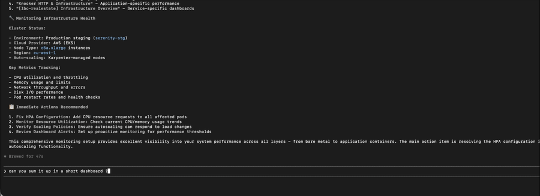

# 📊 DatadOps - Intelligent Monitoring Workflows

**Advanced Datadog workflows for Claude Code** - Transforms raw monitoring data into actionable insights through intelligent DatadOps automation.

## 🎬 Demo

[](docs/assets/datadops_demo.mp4)

[Long demo version](docs/assets/datadops_demo.mp4)

## ✨ What is DatadOps?

A **lightweight Claude Code plugin** that bundles the [official Datadog MCP server](https://docs.datadoghq.com/bits_ai/mcp_server/) configuration and adds intelligent workflows on top of it. The official server provides access to raw Datadog data; DatadOps orchestrates that data into complete operational workflows.

### 🆚 Official MCP Server vs DatadOps

| Aspect | Official Datadog MCP | DatadOps |
|--------|---------------------|-------------------|
| **Purpose** | Raw data access | Intelligent workflows |
| **Usage** | `search_datadog_logs`, `get_datadog_metric` | *"Investigate payment service issues"* |
| **Output** | JSON data | Actionable insights + recommendations |
| **Expertise** | Requires Datadog knowledge | Guides non-experts |
| **Scope** | Individual queries | End-to-end scenarios |

## 🚀 Key Features

### 🚨 **Incident Response Automation**
- **Multi-signal correlation**: Automatically correlates logs, metrics, APM traces
- **Timeline reconstruction**: Maps events, deployments, and failures  
- **Impact assessment**: Quantifies customer and business impact
- **Actionable remediation**: Specific next steps with confidence levels

### 🔍 **Performance Investigation**
- **Bottleneck identification**: Pinpoints root causes across the stack
- **Resource correlation**: Links performance to infrastructure constraints
- **Optimization recommendations**: Specific improvements with impact estimates
- **Trend analysis**: Historical context and pattern recognition

### 📋 **Deployment Validation**
- **Before/after comparison**: Statistical analysis of deployment impact
- **Regression detection**: Automated identification of performance degradations
- **Rollback recommendations**: Data-driven go/no-go decisions
- **Health scoring**: Quantified deployment success metrics

### 🩺 **Service Health Dashboards**
- **Overall health scoring**: 0-100 health scores with component breakdown
- **Proactive alerting**: Early warning before customer impact
- **Dependency mapping**: Service relationship health analysis
- **Executive reporting**: Business-friendly health summaries

## 🎯 Perfect For

### **SRE/DevOps Teams**
- Faster incident response (30-minute investigations → 5 minutes)
- Standardized troubleshooting procedures
- Automated deployment validation
- Proactive performance optimization

### **Development Teams**
- Performance bottleneck identification without deep Datadog expertise
- Deployment confidence through automated health checks
- Quick service health assessment
- Integration with CI/CD pipelines

### **Management & Product**
- Service health visibility in business terms
- Impact assessment for incidents
- Performance trend reporting
- Resource optimization ROI

## 📊 Usage Examples

### Incident Response
```
User: "Payment service is returning 500 errors. Help me investigate."

DatadOps Response:
🚨 INCIDENT ANALYSIS - Payment Service

SEVERITY: HIGH (Customer Impact Detected)
DURATION: 23 minutes (since 14:37 UTC)

ROOT CAUSE ANALYSIS:
• Database connection pool exhaustion (95% utilization)
• Spike in payment processing requests (+300% vs baseline)
• Payment gateway API latency increased to 2.4s (baseline: 200ms)

IMMEDIATE ACTIONS:
1. Scale payment service to 6 instances (currently 3)
2. Increase DB connection pool from 20→40
3. Enable circuit breaker for payment gateway

IMPACT:
• ~1,200 affected transactions
• Payment success rate: 45% (baseline: 99.2%)
• Estimated revenue impact: $15K/hour

MONITORING:
• payment.success_rate < 95%: Page oncall
• db.connections > 90%: Auto-scale
```

### Performance Investigation
```
User: "Checkout service is slow. What's the bottleneck?"

DatadOps Response:
🔍 PERFORMANCE ANALYSIS - Checkout Service

PERFORMANCE DEGRADATION: 340ms → 1.2s (P95 latency)

BOTTLENECK BREAKDOWN:
1. 🥇 Database queries: 420ms (35% of total)
   - Order validation: 180ms (missing index on user_id)
   - Inventory check: 240ms (N+1 query pattern)

2. 🥈 External API calls: 380ms (32% of total)
   - Payment gateway: 280ms (network latency)
   - Inventory service: 100ms (within SLA)

3. 🥉 Application logic: 260ms (22% of total)
   - Price calculation: 180ms (inefficient algorithm)

OPTIMIZATION RECOMMENDATIONS:
• HIGH IMPACT: Add index on orders(user_id) → -180ms
• MEDIUM IMPACT: Batch inventory queries → -150ms  
• LOW IMPACT: Cache price calculations → -100ms

ESTIMATED IMPROVEMENT: 1.2s → 590ms (51% faster)
```

### Deployment Health Check
```
User: "Validate the checkout-service v2.1.4 deployment."

DatadOps Response:
📋 DEPLOYMENT HEALTH - Checkout Service v2.1.4

OVERALL HEALTH SCORE: 92/100 ✅ HEALTHY

METRICS COMPARISON (30min post vs baseline):
✅ Success Rate: 99.1% → 99.3% (+0.2%)
✅ P95 Latency: 280ms → 260ms (-7%)
✅ Error Rate: 0.8% → 0.5% (-37%)
⚠️  CPU Usage: 45% → 65% (+44%)

PERFORMANCE IMPACT:
• Response times improved across all percentiles
• Memory usage stable (+2%)
• No new error patterns detected
• Database performance unchanged

RECOMMENDATIONS:
✅ Continue deployment - performance improved
⚠️  Monitor CPU usage - approaching 70% threshold
📈 Consider auto-scaling trigger adjustment

NEXT CHECKPOINT: Monitor for 2 hours, validate at high traffic
```

## 🛠 Installation

### 1. Install DatadOps Plugin
```bash
claude plugin install datadops
```

This installs the plugin and its bundled Datadog MCP configuration.
If you install or update the plugin during an active Claude Code session, run `/reload-plugins`.

### 2. Authenticate with Datadog
1. Open Claude Code
2. Type `/mcp`
3. Select `datadog` → Authenticate
4. Complete the OAuth flow in your browser

### 3. Test Installation
```
Ask Claude: "Give me a health overview of production services"
```

Or invoke the skill directly:
```
/datadops:service-health-overview production services
```

[📖 **Detailed Installation Guide**](setup/installation-guide.md)

## 🎮 Skills Overview

| Skill | Trigger Phrases | Time to Resolution |
|-------|----------------|-------------------|
| **incident-response** | "investigate incident", "service down", "production issues" | 2-5 minutes |
| **performance-investigation** | "performance issue", "slow response", "bottleneck" | 3-7 minutes |
| **deployment-health-check** | "validate deployment", "check release" | 1-3 minutes |
| **service-health-overview** | "health check", "service status", "overview" | 30-60 seconds |

## 🏗 Architecture

```
┌─────────────────┐    ┌──────────────────┐    ┌─────────────────┐
│                 │    │                  │    │                 │
│  Claude Code    │◄──►│    DatadOps      │◄──►│  Datadog MCP    │
│                 │    │  Plugin          │    │  Server         │
│  (User Query)   │    │  (Workflows)     │    │  (Raw Data)     │
└─────────────────┘    └──────────────────┘    └─────────────────┘
                                ▲                         ▲
                                │                         │
                       Orchestrates 15-20            Fetches from
                       MCP tools into               Official Datadog
                       complete workflows                API
```

## 📈 Impact Metrics

**Before DatadOps:**
- 30+ minutes per incident investigation
- Manual correlation across multiple Datadog pages
- Inconsistent troubleshooting approaches
- High expertise barrier for non-SRE teams

**After DatadOps:**
- < 5 minutes for comprehensive incident analysis
- Automated multi-signal correlation
- Standardized investigation workflows  
- Accessible to all team members

## 🤝 Contributing

### Adding New Skills

1. **Identify workflow gap**: What manual process takes > 10 minutes?
2. **Map MCP tools needed**: Which official Datadog MCP tools are required?
3. **Define success criteria**: What constitutes a successful workflow outcome?
4. **Create skill template**: Follow existing skill structure
5. **Add test cases**: Include realistic scenarios and expected outcomes

### Skill Template

```markdown
---
name: your-skill-name
description: Brief description with trigger conditions
compatibility:
  tools: [datadog]
  dependencies: [list_of_required_mcp_tools]
---

# Your Skill Name

## Capabilities
- What this skill accomplishes
- Key value propositions

## Usage Examples
- Realistic user prompts
- Expected workflow outputs

## Success Metrics
- Time to resolution targets
- Accuracy/completeness measures
```

## 📄 License

MIT License - Use freely, contribute back improvements.

## 🔗 Related Projects

- [Official Datadog MCP Server](https://docs.datadoghq.com/bits_ai/mcp_server/)
- [Claude Code Plugins](https://claude.com/plugins)
- [Model Context Protocol](https://modelcontextprotocol.io/)

## 🔎 Validation

Run the local smoke test before publishing plugin changes:

```bash
python3 scripts/smoke_test.py
```

---

**🚀 Ready to transform your Datadog monitoring into intelligent workflows?**

[📖 Get Started](setup/installation-guide.md) • [🎯 View Test Cases](test-cases.json) • [💡 Request Features](https://github.com/your-repo/issues)
